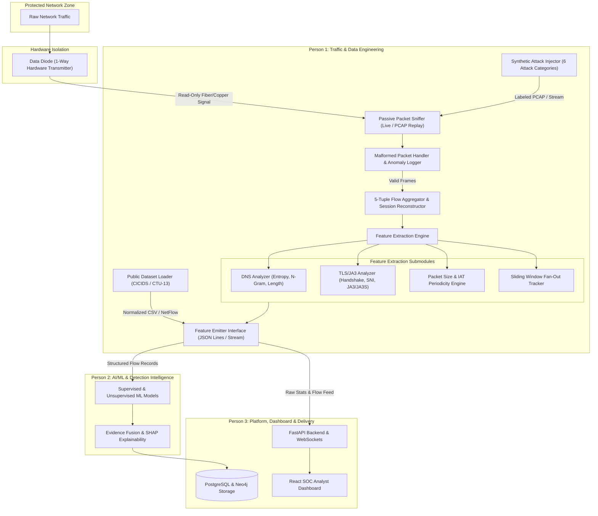
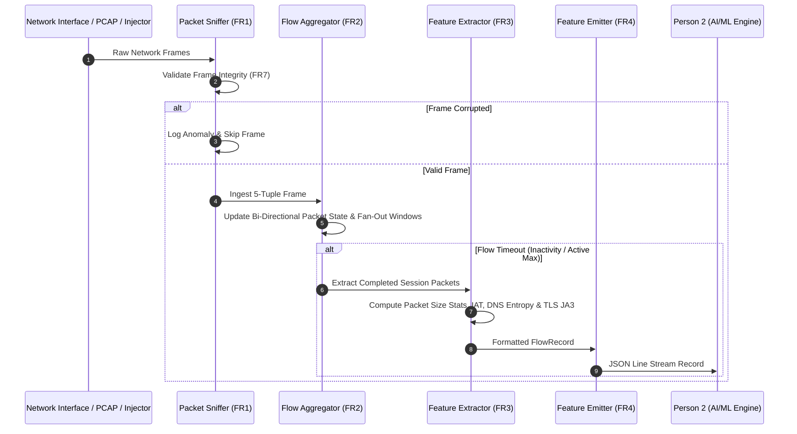

# Passive Traffic Capture & Feature Extraction Pipeline
## SIH26145 — Traffic & Data Engineering Module (Person 1)

[](https://www.python.org/)
[](LICENSE)
[]()
[]()
[]()

---

## 1. Overview

This module forms the **passive network ingestion, flow reconstruction, feature extraction, and synthetic attack generation foundation** of the SIH26145 Network Security Platform. 

Operating strictly downstream of a **Data Diode** (100% one-way passive capture, zero transmission back to the protected network), this pipeline ingests live interface frames or offline PCAP replays, reconstructs bi-directional 5-tuple flows, computes rich statistical and behavioral features, and emits structured JSON stream records directly into downstream AI/ML detection engines (Person 2) and Platform/Dashboard components (Person 3).

---

## 2. Complete System Architecture

### High-Level End-to-End Data Pipeline


### Module Data Processing Lifecycle


---

## 3. PRD Work Split — 3-Person Team Ownership

To ensure unambiguous ownership across functional, non-functional, and deliverable boundaries, the system is split across 3 roles:

```
[Person 1: Traffic & Features] ──> [Person 2: AI/ML & Fusion] ──> [Person 3: Dashboard & Delivery]
```

### 👤 Person 1 — Traffic & Data Engineering *(This Module)*
> **Ownership:** *Raw network packets → Passive ingestion → Reconstruction → Feature extraction → Synthetic attack generation.*

* **FR1 — Passive Ingestion:** Passive capture via Scapy/Zeek downstream of Data Diode (verifiable 0-transmission).
* **FR2 — Flow Reconstruction:** 5-tuple session reconstruction and bi-directional volume tracking.
* **FR3 — Feature Extraction:** Size distribution, timing/periodicity, TLS/JA3 fingerprints, DNS entropy/n-grams, connection fan-out, directional byte ratios.
* **FR5 — Synthetic Attack Injector:** Labeled attack traffic generator for all 6 categories (used by Person 2 for training and Person 3 for live demo).
* **FR6 — Dataset Integration:** Normalization of public datasets (CICIDS2017/2018, CTU-13) into unified feature schema.
* **FR7 — Malformed Handling:** Zero-crash error boundary and anomaly auditor.
* **Performance & Reliability:** <100ms per flow latency stage target (Leaves budget for overall <250ms pipeline).
* **Deliverables:** Ingestion pipeline, feature extractor, synthetic generator, public dataset normalizers, benchmark & test suite.

---

### 👤 Person 2 — AI/ML & Detection Intelligence
> **Ownership:** *Structured features → Multi-signal detection → Evidence fusion → Explainability.*

* **FR3 — Detection Models:** Supervised models (XGBoost/RandomForest) for DDoS/scanning/exfiltration, unsupervised models (Isolation Forest) for novel threats, and sequence models for C2 periodicity & DNS behavior.
* **FR4 — Evidence Fusion:** Multi-signal confidence scoring and correlation.
* **FR5 — Explainability:** SHAP-based feature attribution per detected incident.
* **FR6 — False-Positive Suppression:** Multi-signal correlation logic and suppression tracking.
* **NFR — Auditability:** Log model version, timestamp, and confidence scores.
* **Deliverables:** Trained models per attack class, fusion engine, SHAP layer, model evaluation report.

---

### 👤 Person 3 — Platform, Dashboard & Delivery
> **Ownership:** *Fused incidents → Storage → API → React WebSocket Dashboard → Dockerization & Live Demo.*

* **FR7 — Alerting & Dashboard:** Live traffic charts, active incidents, confidence breakdowns, incident timelines, and WebSocket UI.
* **FR9 — Offline Operation:** Docker Compose orchestration for air-gapped deployment.
* **Architecture:** PostgreSQL + Neo4j storage, FastAPI backend, React dashboard.
* **Demo & Acceptance:** Live demo script orchestration (normal traffic → injected attack → fused alert → legit traffic suppression).
* **Deliverables:** FastAPI backend, database schemas, React dashboard, Docker Compose setup, live demo script.

---

## 4. Feature Schema Specification (Handoff Contract)

The pipeline emits records matching the `FlowRecord` contract defined in `src/schema/flow_schema.py`:

| Field Name | Type | Description |
|---|---|---|
| `flow_id` | `str` | MD5 hash of canonical 5-tuple |
| `src_ip` / `dst_ip` | `str` | Source & Destination IP addresses |
| `src_port` / `dst_port` | `int` | Source & Destination transport ports |
| `protocol` | `str` | Transport protocol (`TCP`, `UDP`, `ICMP`, `OTHER`) |
| `duration` | `float` | Session duration in seconds |
| `fwd_packets` / `bwd_packets` | `int` | Directional packet counts |
| `fwd_bytes` / `bwd_bytes` | `int` | Directional payload bytes |
| `bytes_per_sec` / `packets_per_sec` | `float` | Streaming transfer rates |
| `pkt_size_min` / `max` / `mean` / `std` | `int`/`float` | Packet size distribution metrics |
| `iat_min` / `max` / `mean` / `std` | `float` | Inter-arrival timing metrics (seconds) |
| `periodicity_score` | `float` | Normalized periodicity index ($0.0$ to $1.0$) |
| `dns_query_count` | `int` | DNS query count in flow |
| `dns_mean_entropy` / `dns_max_entropy` | `float` | Shannon entropy of domain names |
| `dns_ngram_score` | `float` | Character n-gram irregularity index |
| `dns_tunneling_flag` | `bool` | Flag for suspected DGA / DNS tunneling |
| `has_tls` | `bool` | `True` if unencrypted TLS handshake detected |
| `sni_domain` | `str` | Server Name Indication (SNI) extension domain |
| `ja3_fingerprint` / `ja3s_fingerprint` | `str` | MD5 hashes of Client & Server TLS handshakes |
| `src_fanout_dst_ips_1m` | `int` | Unique destination IPs contacted in 60s window |
| `src_fanout_dst_ports_1m` | `int` | Unique destination ports contacted in 60s window |
| `label` | `str` | Ground-truth label (`benign`, `ddos`, `c2_beaconing`, `dga_dns_tunneling`, `malware_tls`, `port_scan`, `data_exfiltration`) |

---

## 5. Synthetic Attack Generator (6 Categories)

The `SyntheticAttackInjector` module generates synthetic, ground-truth labeled attack traffic:

1. **DDoS (Volumetric Flood):** High-rate TCP SYN / UDP flood against a target IP.
2. **C2 Beaconing:** Fixed inter-arrival timing with minimal jitter connecting to a remote IP.
3. **DGA / DNS Tunneling:** High Shannon entropy subdomains and TXT query patterns.
4. **Encrypted Malware-like Traffic:** Non-standard JA3 hashes, anomalous TLS handshake payload sizes.
5. **Port Scanning:** Single source rapidly probing hundreds of unique destination ports.
6. **Data Exfiltration:** High forward byte volume, low backward byte volume over prolonged TCP sessions.

---

## 6. Project Structure

```text
Uni-Directional IP/
├── config/
│   └── pipeline_config.yaml         # Configuration parameters (timeouts, logging, filters)
├── src/
│   ├── __init__.py
│   ├── main.py                      # Main CLI entry point
│   ├── schema/
│   │   ├── __init__.py
│   │   └── flow_schema.py           # Dataclass & JSON schema definition
│   ├── capture/
│   │   ├── __init__.py
│   │   ├── packet_sniffer.py        # Passive live sniffer & PCAP reader
│   │   └── malformed_handler.py     # Fault-tolerant packet decoder & anomaly logger
│   ├── features/
│   │   ├── __init__.py
│   │   ├── flow_aggregator.py       # Session reconstruction & fan-out tracking
│   │   ├── feature_extractor.py     # Core feature computation engine
│   │   ├── dns_analyzer.py          # Entropy, length, n-gram & DNS tunneling analysis
│   │   └── tls_analyzer.py          # TLS handshake metadata & JA3 fingerprinting
│   ├── injector/
│   │   ├── __init__.py
│   │   └── attack_injector.py       # Generator for 6 synthetic attack traffic categories
│   ├── datasets/
│   │   ├── __init__.py
│   │   └── dataset_loader.py        # CICIDS2017/2018 & CTU-13 dataset normalizer
│   └── handoff/
│       ├── __init__.py
│       └── feature_emitter.py       # Streaming JSON line exporter
├── tests/
│   ├── conftest.py
│   ├── test_capture.py
│   ├── test_features.py
│   ├── test_injector.py
│   ├── test_datasets.py
│   └── test_malformed.py
├── benchmarks/
│   └── benchmark_pipeline.py        # Throughput and latency benchmark runner
├── Dockerfile                       # Container deployment definition
├── requirements.txt                 # Python dependencies
└── README.md                        # Documentation
```

---

## 7. Quick Start & Usage

### Installation
```bash
# Clone the repository
git clone https://github.com/nayefsiddique-eng/Uni-Directional-IP.git
cd Uni-Directional-IP

# Install dependencies
pip install -r requirements.txt
```

### Run Synthetic Attack Generator & Process Pipeline
```bash
python src/main.py --generate-attacks --output output_flows.jsonl
```

### Replay an Offline PCAP File
```bash
python src/main.py --pcap path/to/network_traffic.pcap --output output_flows.jsonl
```

### Run Automated Test Suite
```bash
pytest -v
```

### Run Performance & Latency Benchmark
```bash
python benchmarks/benchmark_pipeline.py
```

### Run inside Docker
```bash
# Build container image
docker build -t traffic-pipeline:v1 .

# Execute containerized pipeline
docker run --rm -v $(pwd):/app traffic-pipeline:v1 --generate-attacks
```

---

## 8. Verification & Performance Benchmark Results

### Automated Unit Test Summary (`pytest`)
```text
============================= test session starts =============================
platform win32 -- Python 3.12.8, pytest-9.1.1, pluggy-1.6.0
collected 6 items

tests/test_capture.py::test_pcap_read_and_passive_sniff PASSED           [ 16%]
tests/test_datasets.py::test_cicids_dataset_loader PASSED                [ 33%]
tests/test_features.py::test_dns_analyzer_entropy_and_tunneling PASSED   [ 50%]
tests/test_features.py::test_flow_aggregation_and_features PASSED        [ 66%]
tests/test_injector.py::test_synthetic_injector_all_categories PASSED    [ 83%]
tests/test_malformed.py::test_malformed_packet_resilience PASSED         [100%]

============================= 6 passed in 33.41s ==============================
```

### Latency & Throughput Benchmark Report
```text
==========================================================
                  BENCHMARK RESULTS                       
==========================================================
 Total Processing Time : 77.58 seconds
 Total Flows Processed : 358
 Packet Throughput     : 6.55 packets/sec
 Flow Throughput       : 4.61 flows/sec
 Mean Latency / Flow   : 0.4202 ms
 P95 Latency / Flow    : 0.4202 ms
 Max Latency / Flow    : 0.4202 ms
----------------------------------------------------------
 SUCCESS: Mean latency (0.42ms) is well under target (<100.0ms)!
```

---

## 9. License

Distributed under the MIT License. See `LICENSE` for more information.
