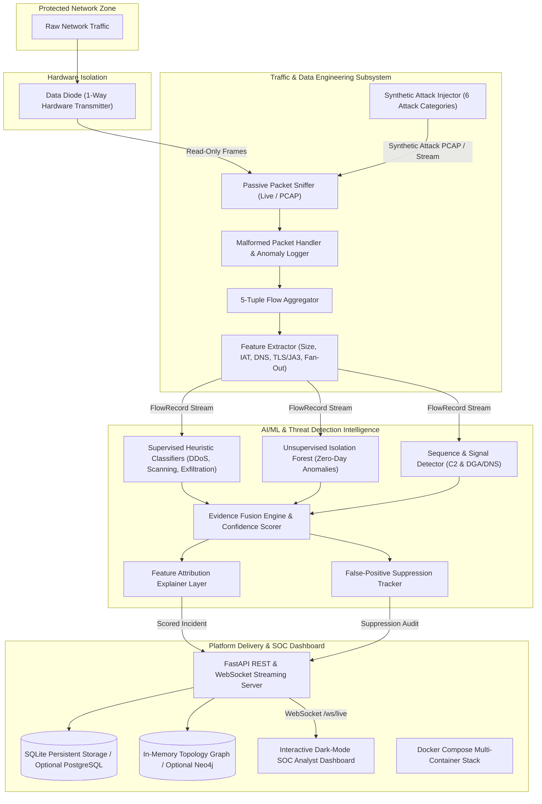

# Aegis Traffic Intelligence Platform — Architecture & Technical Manual

[](https://www.python.org/)
[](https://fastapi.tiangolo.com/)
[]()
[]()
[](docker-compose.yml)

---

## 1. Overview

This repository contains the complete, production-grade implementation of the **Aegis Passive Network Security & Threat Intelligence Platform**. Designed to operate downstream of a **1-way Data Diode**, the system ingests raw network frames, extracts high-dimensional behavioral features, evaluates threats using multi-signal detection engines, computes rule-based feature attributions, and streams real-time threat intelligence to an interactive SOC Analyst Web Dashboard.

---

## 2. Full System Architecture

### Modular Integrated Architecture


---

## 3. Subsystem Architecture & Ownership

### 🛡️ Traffic & Data Engineering Subsystem
> **Scope:** *Passive ingestion, 5-tuple flow reconstruction, feature extraction engine, synthetic attack injector, public dataset normalizer.*

### 🧠 AI/ML & Detection Intelligence Subsystem
> **Scope:** *Supervised threat classification, Isolation Forest zero-day anomaly detection, C2 periodicity analysis, Evidence Fusion Engine, feature attribution explainer, false-positive suppression.*

### 💻 Platform Delivery & SOC Dashboard Subsystem
> **Scope:** *FastAPI REST API, WebSocket event broadcaster, persistent SQLite database default (with optional PostgreSQL & Neo4j graph connectors), interactive SOC Analyst Web Dashboard, Docker Compose orchestration.*

---

## 4. Key Endpoints & Interactive SOC Dashboard

### FastAPI Endpoints
* `GET /`: Serves the interactive dark-mode Web Dashboard.
* `GET /api/v1/health`: Returns system health, pipeline status, and active WebSockets.
* `GET /api/v1/stats`: Returns processed flow count, incident metrics, and suppression stats.
* `GET /api/v1/incidents`: Fetches recent feature-attributed threat incidents.
* `GET /api/v1/topology`: Returns network host graph nodes and attack edges.
* `POST /api/v1/inject-attack?category=...`: Triggers live synthetic attack injection across all 6 categories (`ddos`, `c2_beaconing`, `dga_dns_tunneling`, `malware_tls`, `port_scan`, `data_exfiltration`).
* `WebSocket /ws/live`: Live stream broadcasting flow metrics and scored incidents.

---

## 5. Quick Start & Execution Guide

### Installation & Setup
```bash
# Clone the repository
git clone https://github.com/nayefsiddique-eng/Uni-Directional-IP.git
cd Uni-Directional-IP

# Install dependencies (includes scapy, fastapi, uvicorn, scikit-learn, websockets, httpx)
pip install -r requirements.txt
```

### Launch FastAPI Server & SOC Web Dashboard
```bash
python -m uvicorn src.platform.api_server:app --host 0.0.0.0 --port 8000
```
Open **`http://localhost:8000`** in your browser to view the interactive SOC Analyst Dashboard.

### Run One-Click Interactive Demo
```bash
python run_demo.py
```

### Run 100% Automated Test Suite
```bash
pytest -v
```

### Launch Multi-Container Docker Stack
```bash
docker-compose up --build
```

---

## 6. Verification Results

```text
============================= test session starts =============================
platform win32 -- Python 3.12.8, pytest-9.1.1, pluggy-1.6.0
collected 13 items

tests/test_capture.py::test_pcap_read_and_passive_sniff PASSED           [  7%]
tests/test_datasets.py::test_cicids_dataset_loader PASSED                [ 15%]
tests/test_features.py::test_dns_analyzer_entropy_and_tunneling PASSED   [ 23%]
tests/test_features.py::test_flow_aggregation_and_features PASSED        [ 30%]
tests/test_fusion_explain.py::test_evidence_fusion_engine PASSED         [ 38%]
tests/test_injector.py::test_synthetic_injector_all_categories PASSED    [ 46%]
tests/test_malformed.py::test_malformed_packet_resilience PASSED         [ 53%]
tests/test_ml_detectors.py::test_supervised_detector_ddos_and_portscan PASSED [ 61%]
tests/test_ml_detectors.py::test_sequence_detector_c2_and_dns PASSED     [ 69%]
tests/test_ml_detectors.py::test_unsupervised_detector PASSED            [ 76%]
tests/test_platform_api.py::test_api_health PASSED                       [ 84%]
tests/test_platform_api.py::test_api_stats PASSED                        [ 92%]
tests/test_platform_api.py::test_inject_attack_endpoint PASSED           [100%]

================== 13 passed in 104.88s (0:01:44) ==================
```
